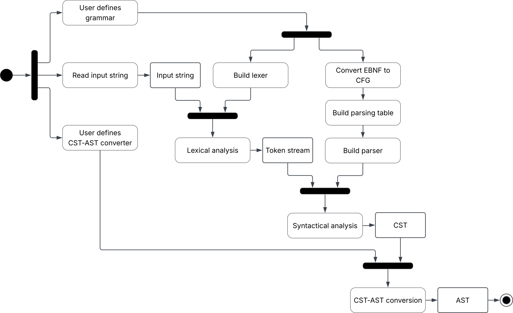

# Requirement specification
## Requisiti di business
| ID | Testo del requisito                                                                                                                                                                           | Criterio di accettazione                                                                                                   |
|----|-----------------------------------------------------------------------------------------------------------------------------------------------------------------------------------------------|----------------------------------------------------------------------------------------------------------------------------|
| B1 | Il sistema deve migliorare l'esperienza dell'utilizzatore nello sviluppo del frontend di un compilatore, richiedendo di implementare unicamente gli aspetti specifici del proprio linguaggio. | Il caso d'uso FINF non presenta dettagli implementativi di analisi lessicale e semantica.                                  |
| B2 | Il sistema deve migliorare l'esperienza dell'utilizzatore nello sviluppo del frontend di un compilatore, favorendo l'uso di codice idiomatico ed espressivo in scala.                         | Il caso d'uso FINF è realizzabile in stile EBNF e si basa su meccanismi di alto livello.                                   |
| B3 | Il sistema deve permettere lo sviluppo di linguaggi non banali.                                                                                                                               | Il caso d'uso FINF è funzionante in tutti i suoi aspetti.                                                                  |
| B4 | Il sistema permette agli sviluppatori della libreria di esplorare i paradigmi e i concetti centrali per il corso.                                                                             | All'interno della libreria viene fatto uso di programmazione logica e di meccanismi avanzati di programmazione funzionale. |
//TODO: in base all'introduzione, semplificare e cambiare con:
* "Il sistema deve migliorare l'esperienza dell'utilizzatore, richiedendo di implementare unicamente gli aspetti specifici del proprio linguaggio."
* "Il sistema deve migliorare l'esperienza dell'utilizzatore, favorendo l'uso di codice idiomatico ed espressivo in scala."

//TODO: FINF deve essere annesso come caso d'uso nella libreria all'interno del capitolo zero.

## Modello di dominio

## Requisiti funzionali

### Utente

### Sistema

## Requisiti non funzionali

| ID  | Testo del requisito                                                                                                                                               | Criterio di accettazione                                                                                                                      |
|-----|-------------------------------------------------------------------------------------------------------------------------------------------------------------------|-----------------------------------------------------------------------------------------------------------------------------------------------|
| NF1 | Il sistema, in quanto libreria, deve esporre una API robusta, chiara e intuitiva.                                                                                 | Tipi e metodi pubblici rispecchiano il modello di dominio e sono documentati dettagliatamente.                                                |
| NF2 | Il sistema deve produrre riscontri chiari e costruttivi in caso di errori lessicali o sintattici.                                                                 | Ad ogni tipo di errore è associata una descrizione dettagliata.                                                                               |
| NF3 | Il sistema deve essere in grado di inizializzare un lexer e un parser a partire da una grammatica e analizzare un file di input il tutto in un tempo accettabile. | Considerando la grammatica FINF e il file di input `quicksort.finf`, il tempo di esecuzione totale non supera i 10 secondi su hardware medio. |

## Requisiti di implementazione

| ID | Testo del requisito                                                                                                                           | Criterio di accettazione                                                         |
|----|-----------------------------------------------------------------------------------------------------------------------------------------------|----------------------------------------------------------------------------------|
| I1 | Il sistema deve mantenere un'alta qualità interna durante l'intero processo di sviluppo.                                                      | Vengono applicati correttamente i principi di RF, SOC, MOD, ABS, AOC, GEN e INC. |
| I2 | Il sistema deve essere sviluppato primariamente in Scala 3, utilizzando sbt come build system.                                                |                                                                                  |
| I3 | Il sistema deve essere testato durante l'intero processo di sviluppo utilizzando la libreria ScalaTest.                                       | Viene adottato l'approccio TDD.                                                  |
| I4 | Gli elementi più formali del sistema devono essere sviluppati in Prolog e integrati nell'ambiente Scala attraverso la libreria TuProlog Core. |                                                                                  |
