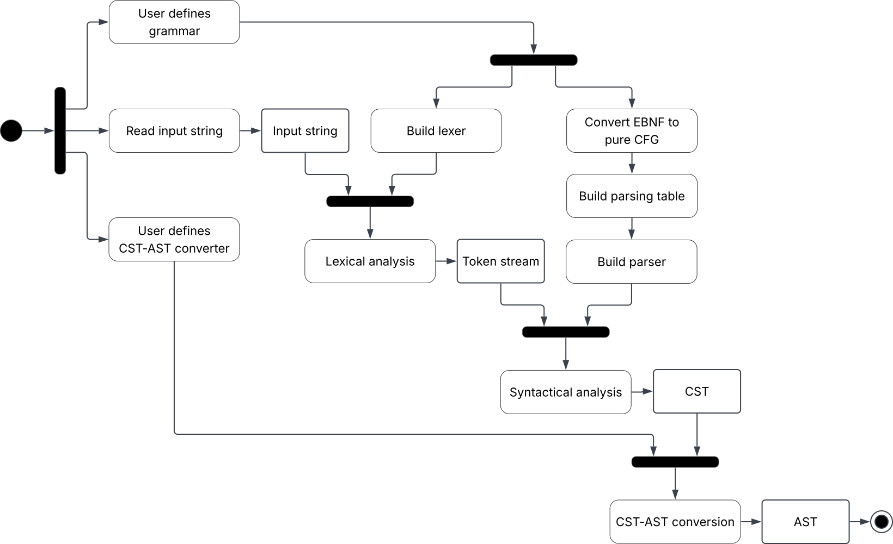

# Requirement specification

## Requisiti di business

Vengono inclusi aspetti che rendono il progetto strategico sia in qualità di elaborato soggetto a valutazione, sia in qualità di prodotto utilizzabile da terzi.

| ID | Testo del requisito                                                                                                                             | Criterio di accettazione                                                                                                   |
|----|-------------------------------------------------------------------------------------------------------------------------------------------------|----------------------------------------------------------------------------------------------------------------------------|
| B1 | Il sistema deve migliorare l'esperienza dell'utilizzatore, richiedendo di implementare unicamente gli aspetti specifici del proprio linguaggio. | Il caso d'uso FINF non presenta dettagli implementativi di analisi lessicale e semantica.                                  |
| B2 | Il sistema deve migliorare l'esperienza dell'utilizzatore, favorendo l'uso di codice idiomatico ed espressivo in scala.                         | Il caso d'uso FINF è realizzabile in stile EBNF e si basa su meccanismi di alto livello.                                   |
| B3 | Il sistema deve permettere lo sviluppo di linguaggi non banali.                                                                                 | Il caso d'uso FINF è funzionante in tutti i suoi aspetti.                                                                  |
| B4 | Il sistema permette agli sviluppatori della libreria di esplorare i paradigmi e i concetti centrali per il corso.                               | All'interno della libreria viene fatto uso di programmazione logica e di meccanismi avanzati di programmazione funzionale. |

## Modello di dominio

### Terminologia

* Un simbolo terminale, o semplicemente terminale, rappresenta un elemento lessicale non ulteriormente scomponibile.
* Un simbolo nonterminale, o semplicemente nonterminale, rappresenta un elemento sintattico che definisce un insieme di combinazioni valide di simboli terminali e nonterminali.
* Una grammatica libera dal contesto, o CFG, raccoglie un insieme di terminali e nonterminali che definiscono un linguaggio libero dal contesto.
  In forma "pura" ogni nonterminale è definito da un insieme di produzioni, dove ciascuna ha un corpo costituito da una semplice sequenza di simboli.
  In forma estesa di Backus-Naur, o EBNF, ogni nonterminale è definito da una singola regola, che però consente l'uso di operatori aggiuntivi, ad esempio di ripetizione.
* Una CFG (pura) si dice fattorizzata a sinistra (_left-factored_) quando è priva di produzioni che abbiano la stessa testa e corpi che condividono un prefisso comune.
* Un lessema rappresenta una porzione significativa di una stringa di caratteri in input.
* Un token associa a un lessema un simbolo terminale della grammatica. 
* Un lexer, o analizzatore lessicale, trasforma una stringa di caratteri in uno stream di token.
* Un albero sintattico concreto, o CST, rappresenta la struttura sintattica di una stringa di input secondo le regole di una grammatica.
* Un parser, o analizzatore sintattico, trasforma uno stream di token in un CST. Un parser LL(1) sfrutta assunzioni sul tipo di linguaggio, risultando in un algoritmo più semplice e performante.
* Una tabella di parsing è una struttura a supporto dell'algoritmo di parsing LL(1) che ne determina il comportamento in base allo stato attuale. 
* Un albero sintattico astratto, o AST, è una rielaborazione della struttura sintattica incentrata sui contenuti di rilevanza semantica.

### Struttura e comportamento

Il diagramma di attività illustra il flusso di esecuzione per l'elaborazione del codice sorgente.
La prima fase è costituita da tre input generati dell'utilizzatore:
la definizione della grammatica, la stringa di input da analizzare e le regole di conversione CST-AST.
Successivamente viene costruito il lexer e l'EBNF viene convertita in CFG pura, permettendo la generazione della parsing table necessaria per istanziare il parser.
In seguito a questa fase di costruzione inizia l'analisi lessicale, con il lexer che processa la stringa di input restituendo uno stream di token, preso a sua volta in input dal parser che, seguendo la parsing table, esegue l'analisi sintattica. La struttura viene validata andando a generare l'albero CST, il quale viene decodificato dal convertitore definito dall'utilizzatore che restituisce come output l'AST.

### Algoritmo LL(1)

L'algoritmo di parsing LL(1) richiede il calcolo dei FIRST set e FOLLOW set, definiti come segue:

* $\mathrm{FIRST}(X) = \lbrace\, b \;|\; X \Rightarrow^* b\,\alpha \,\rbrace \;\cup\; \lbrace\, \varepsilon \;|\; X \Rightarrow^* \varepsilon \,\rbrace$&ensp;dove $X$ è un simbolo della grammatica.
* $\mathrm{FIRST}(X_1X_2\!\cdots\!X_n) = \lbrace\, b \;|\; X_1X_2\!\cdots\!X_n \Rightarrow^* b\,\alpha \,\rbrace \;\cup\; \lbrace\, \varepsilon \;|\; X_1X_2\!\cdots\!X_n \Rightarrow^* \varepsilon \,\rbrace$&ensp;dove $X_1X_2\!\cdots\!X_n$ è una stringa di simboli.
* $\mathrm{FOLLOW}(X) = \lbrace\, b \;|\; S\,\$ \Rightarrow^* \beta\,X\,b\,\delta \,\rbrace$&ensp;dove $S$ è il simbolo iniziale della grammatica.

Sulla base di questi, viene definita la tabella di parsing come segue:

* Se la grammatica contiene la produzione&ensp;$A\rightarrow\alpha$&ensp;e&ensp;$b\in\mathrm{FIRST}(\alpha)$&ensp;allora&ensp;$\mathrm{T}\lbrack A, b \rbrack = \alpha$.
* Se la grammatica contiene la produzione&ensp;$A\rightarrow\alpha$&ensp;e&ensp;$\varepsilon\in\mathrm{FIRST}(\alpha)$&ensp;e&ensp;$b\in\mathrm{FOLLOW}(A)$ allora $\mathrm{T}\lbrack A, b \rbrack = \alpha$.

La grammatica appartiene alla classe LL(1) se ogni cella così definita contiene al massimo un corpo di produzione, 
ovvero se per ogni coppia di produzioni distinte&ensp;$A\rightarrow\alpha$&ensp;e&ensp;$A\rightarrow\beta$:
* $\mathrm{FIRST}(\alpha)\cap\mathrm{FIRST}(\beta)=\emptyset$.
* al massimo una fra $\alpha$ e $\beta$ deriva $\varepsilon$.
* se&ensp;$\beta\Rightarrow^*\varepsilon$&ensp;allora&ensp;$\mathrm{FIRST}(\alpha)\cap\mathrm{FOLLOW}(A)=\emptyset$.

Data la tabella l'analisi procede per configurazioni&ensp;$(\gamma,\,u)$,&ensp;dove $\gamma$ è la sequenza di simboli ancora da riconoscere 
e $u$ l'input non ancora consumato, a partire da&ensp;$(S\,\$,\;w\,\$)$&ensp;e fino all'accettazione in&ensp;$(\$,\;\$)$:

* $(b\,\gamma,\;b\,u)\;\vdash\;(\gamma,\;u)$&ensp;riconoscimento di un terminale, cui corrisponde una foglia del CST.
* $(A\,\gamma,\;b\,u)\;\vdash\;(\alpha\,\gamma,\;b\,u)$&ensp;se&ensp;$\mathrm{T}\lbrack A,b\rbrack=\alpha$,&ensp;espansione di un nonterminale, cui corrisponde un nodo del CST etichettato $A$ avente per figli i sottoalberi di $\alpha$. I nonterminali introdotti dalla conversione EBNF-CFG non compaiono nell'albero: i loro nodi sono sostituiti dalla sequenza dei propri figli.

In assenza di una transizione applicabile l'input non appartiene al linguaggio. L'analisi non si interrompe: l'errore viene registrato e i token vengono scartati fino a incontrarne uno che permetta di
riprendere, ossia appartenente all'insieme di sincronizzazione del simbolo corrente, dato dai terminali che possono iniziarlo uniti a quelli che possono seguirlo nel contesto in cui è stato espanso.

## Requisiti funzionali

### Utente

| ID   | Testo del requisito                                                                                                                                                                                                                          |
|------|----------------------------------------------------------------------------------------------------------------------------------------------------------------------------------------------------------------------------------------------|
| FU1  | L'utilizzatore della libreria deve poter sottoporre al sistema una stringa di testo (codice sorgente) per avviare la pipeline di analisi lessicale e sintattica.                                                                             |
| FU2  | L'utilizzatore della libreria deve poter fornire al sistema un set di regole di decodifica personalizzate per trasformare i nodi dell'albero sintattico (CST) nei nodi del proprio Abstract Syntax Tree (AST).                               |
| FU3  | Tramite l'interfaccia a riga di comando (CLI), l'utente finale deve ricevere report diagnostici che indichino l'esatta riga e colonna in cui si è verificato un errore lessicale o sintattico.                                               |
| FU4  | L'utilizzatore deve poter definire una grammatica in forma EBNF, dichiarando terminali e nonterminali e componendoli con gli operatori di concatenazione, alternativa, opzionalità e ripetizione, per zero o più e per una o più occorrenze. |
| FU5  | L'utilizzatore deve poter definire un terminale tramite il lessema esatto o un'espressione regolare, ed eventualmente dichiararlo da ignorare ai fini dell'analisi sintattica.                                                               |
| FU6  | L'utilizzatore deve poter definire un nonterminale facendo riferimento a nonterminali dichiarati successivamente o al nonterminale stesso, senza vincoli sull'ordine di dichiarazione.                                                       |
| FU7  | L'utilizzatore non deve dover nominare esplicitamente i simboli: ogni terminale o nonterminale assume il nome della definizione che lo introduce.                                                                                            |
| FU8  | L'utilizzatore deve poter ottenere un parser da una tabella di parsing e un simbolo iniziale, e da esso il CST di uno stream di token.                                                                                                       |
| FU9  | L'utilizzatore deve ricevere l'elenco completo degli errori riscontrati in una singola analisi, e non solo il primo, ciascuno corredato della posizione nel sorgente e dei terminali che sarebbero stati ammissibili                         |
| FU10 | Il CST restituito deve contenere unicamente i nonterminali dichiarati dall'utilizzatore.                                                                                                                                                     |

### Sistema

Vengono inclusi vincoli che nel contesto di una libreria di parsing generica costituirebbero decisioni di design. Il progetto ScaLL si basa sull'algoritmo LL(1) come premessa di dominio, dunque prevede alcuni elementi necessari sotto forma di requisiti funzionali di sistema. 

| ID   | Testo del requisito                                                                                                                                                                                                                                                                                          |
|------|--------------------------------------------------------------------------------------------------------------------------------------------------------------------------------------------------------------------------------------------------------------------------------------------------------------|
| FS1  | Il sistema deve rappresentare gli elementi di una grammatica EBNF in forma ricorsiva, valutando la regola che definisce un nonterminale al momento in cui la grammatica viene percorsa e non all'atto della definizione.                                                                                     |
| FS2  | Il sistema deve preservare l'ordine di dichiarazione dei terminali, che ne determina la priorità.                                                                                                                                                                                                            |
| FS3  | Il sistema deve consentire di rappresentare una CFG pura, caratterizzata da un simbolo (nonterminale) di partenza, una collezione di terminali e una collezione di produzioni, ossia associazioni fra nonterminali e sequenze di simboli. Uno stesso nonterminale può costituire la testa di più produzioni. |
| FS4  | Il sistema deve fornire un meccanismo di conversione da una grammatica in EBNF a una CFG pura, una volta specificato il simbolo di partenza.                                                                                                                                                                 |
| FS5  | La conversione EBNF-CFG deve mantenere invariata la collezione di terminali dichiarati, priorità incluse.                                                                                                                                                                                                    |
| FS6  | La conversione EBNF-CFG deve preservare tutti i nonterminali dichiarati, eventualmente aggiungendone di nuovi, limitatamente ai casi in cui siano necessari per rappresentare internamente occorrenze di meccanismi non banali.                                                                              |
| FS7  | La conversione EBNF-CFG deve produrre una grammatica equivalente, cioè che generi lo stesso linguaggio.                                                                                                                                                                                                      |
| FS8  | La conversione EBNF-CFG deve produrre una grammatica fattorizzata a sinistra (_left-factored_).                                                                                                                                                                                                              |
| FS9  | La conversione EBNF-CFG deve produrre una grammatica di classe LL(1) laddove la rappresentazione iniziale lo consenta, in riferimento a un processo che preservi la struttura interna e rispetti i vincoli posti.                                                                                            |
| FS10 | Il sistema deve eseguire l'analisi lessicale convertendo una stringa di input in una sequenza di token, ciascuno associato a un simbolo terminale definito nella grammatica.                                                                                                                                 |
| FS11 | Durante l'analisi lessicale, il sistema deve risolvere le ambiguità applicando la regola del longest-prefix-match.                                                                                                                                                                                           |
| FS12 | A parità di lunghezza tra più match validi, il sistema deve risolvere il conflitto assegnando la priorità al simbolo terminale dichiarato per primo nella grammatica.                                                                                                                                        |
| FS13 | Il sistema deve consumare e scartare in modo silente le porzioni di input corrispondenti a terminali esplicitamente marcati come ignorabili (ad esempio spaziature o commenti).                                                                                                                              |
| FS14 | In presenza di caratteri non riconosciuti da alcuna regola lessicale, il sistema deve isolare il carattere invalido in un token di errore e proseguire l'analisi del resto dell'input senza interrompersi.                                                                                                   |
| FS15 | Il sistema deve tracciare e associare a ogni token generato (sia esso valido o di errore) le coordinate spaziali esatte (numero di riga e numero di colonna) calcolate in base alla sua posizione nel testo originale.                                                                                       |
| FS16 | Il sistema deve consentire di rappresentare una tabella di parsing LL(1). Le celle devono essere identificate da un nonterminale e da un terminale, quest'ultimo possibilmente sostituito da un indicatore di esaurimento dell'input, e devono contenere un corpo di produzione.                             | 
| FS17 | Il sistema deve consentire di rappresentare un CST, i cui nodi sono nodi di regola, etichettati da un nonterminale dichiarato e con una sequenza ordinata di figli, foglie, etichettate da un token, e nodi di errore, che conservano i terminali attesi e i token scartati.                                 |
| FS18 | Il sistema deve sostituire i nodi corrispondenti ai nonterminali introdotti dalla conversione EBNF-CFG con la sequenza dei rispettivi figli.                                                                                                                                                                 |
| FS19 | Il sistema deve riconoscere lo stream di token consultando la tabella di parsing secondo l'algoritmo LL(1), consumando lo stream in modo pigro.                                                                                                                                                              |
| FS20 | In assenza di una transizione applicabile il sistema deve registrare l'errore, scartare i token in input fino a raggiungere un terminale di sincronizzazione e riprendere l'analisi, restituendo gli errori nell'ordine in cui sono stati riscontrati.                                                       |
| FS21 | Il sistema deve riportare fra gli errori dell'analisi sintattica anche quelli prodotti dall'analisi lessicale e l'eventuale input residuo successivo al riconoscimento del simbolo iniziale.                                                                                                                 | 
| FS22 | Il sistema deve fornire un meccanismo di costruzione di una tabella di parsing a partire da una grammatica in forma CFG pura, secondo le specifiche dell'algoritmo LL(1). Nel caso di una grammatica non LL(1) il comportamento non è definito.                                                              |
| FS23 | Il sistema deve fornire un meccanismo di decodifica per elaborare iterativamente un albero sintattico concreto (CST) estraendone gli elementi utili alla costruzione dell'albero astratto (AST).                                                                                                             |
| FS24 | In caso di incongruenze durante la decodifica CST-AST, il sistema deve propagare il fallimento arricchendo l'errore con le coordinate spaziali del nodo responsabile.                                                                                                                                        |
| FS24 | Il caso d'uso FINF deve basarsi su una grammatica che metta in evidenza tutte le funzionalità principali della libreria.                                                                                                                                                                                     |

## Requisiti non funzionali

| ID  | Testo del requisito                                                                                                                                               | Criterio di accettazione                                                                                                                      |
|-----|-------------------------------------------------------------------------------------------------------------------------------------------------------------------|-----------------------------------------------------------------------------------------------------------------------------------------------|
| NF1 | Il sistema, in quanto libreria, deve esporre una API robusta, chiara e intuitiva.                                                                                 | Tipi e metodi pubblici rispecchiano il modello di dominio e sono documentati dettagliatamente.                                                |
| NF2 | Il sistema deve produrre riscontri chiari e costruttivi in caso di errori lessicali o sintattici.                                                                 | Ad ogni tipo di errore è associata una descrizione dettagliata.                                                                               |
| NF3 | Il sistema deve essere in grado di inizializzare un lexer e un parser a partire da una grammatica e analizzare un file di input il tutto in un tempo accettabile. | Considerando la grammatica FINF e il file di input `quicksort.finf`, il tempo di esecuzione totale non supera i 10 secondi su hardware medio. |

## Requisiti di implementazione

| ID | Testo del requisito                                                                                                                           | Criterio di accettazione                                                         |
|----|-----------------------------------------------------------------------------------------------------------------------------------------------|----------------------------------------------------------------------------------|
| I1 | Il sistema deve mantenere un'alta qualità interna durante l'intero processo di sviluppo.                                                      | Vengono applicati correttamente i principi di RF, SOC, MOD, ABS, AOC, GEN e INC. |
| I2 | Il sistema deve essere sviluppato primariamente in Scala 3, utilizzando sbt come build system.                                                |                                                                                  |
| I3 | Il sistema deve essere testato durante l'intero processo di sviluppo utilizzando la libreria ScalaTest.                                       | Viene adottato l'approccio TDD.                                                  |
| I4 | Gli elementi più formali del sistema devono essere sviluppati in Prolog e integrati nell'ambiente Scala attraverso la libreria TuProlog Core. |                                                                                  |
