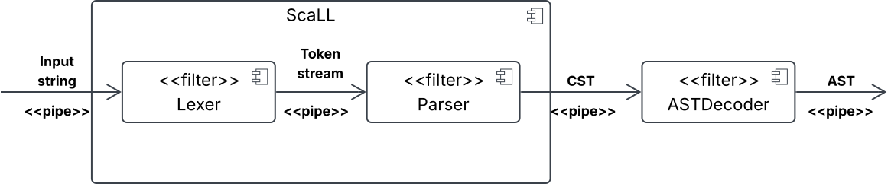

# Design architetturale

Il progetto è suddiviso in due moduli Sbt:
* **ScaLL**, che costituisce la libreria vera e propria.
* **FINF**, un esempio di caso d'uso di ScaLL.

## Pipe and Filter

Il sistema segue il pattern architetturale _Pipe and Filter_, il quale divide un processo in una serie di passi distinti, detti _filter_, collegati da canali, chiamati _pipe_, attraverso cui scorrono i flussi di dati.
L'output di un filtro diventa l'input del successivo. Questo schema consente una forte modularità e scalabilità,
in quanto i filtri sono indipendenti gli uni dagli altri e sono specializzati nel loro compito.

Questo pattern si dimostra essere particolarmente efficace per implementare un compilatore o parti di esso,
in quanto richiede trasformazioni di dati ordinati e sequenziali.

