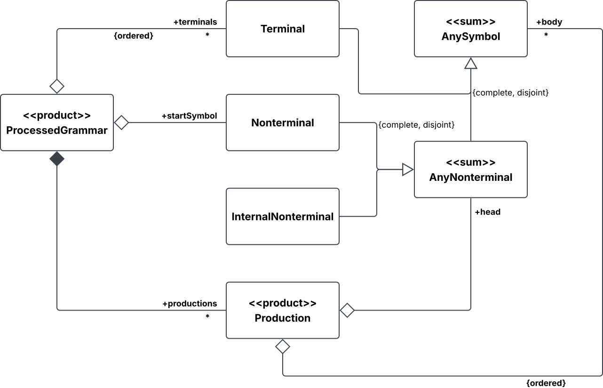
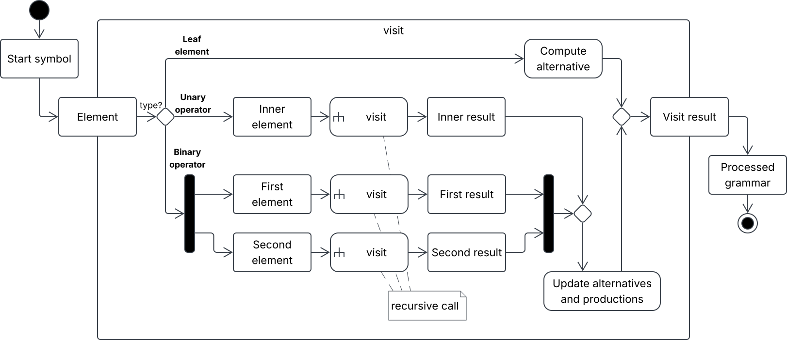
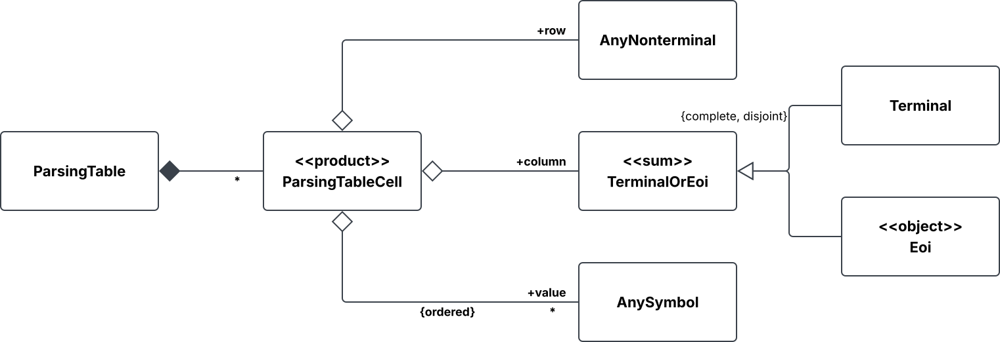
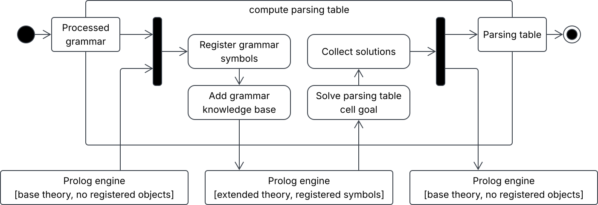
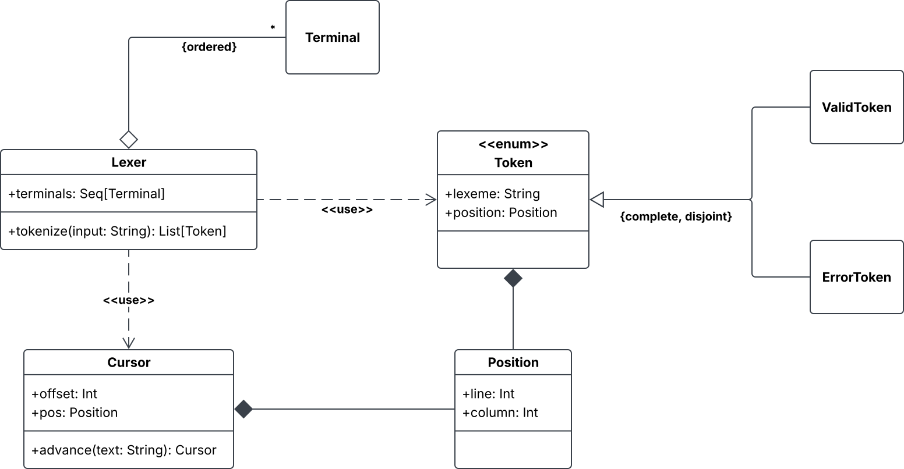
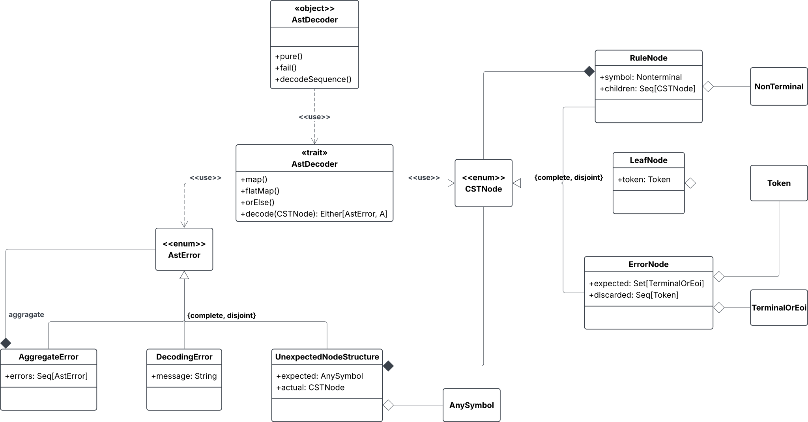

# Design di dettaglio

## Grammatica processata

Volendo rappresentare il risultato della conversione da grammatica EBNF a CFG pura, si introduce il concetto di grammatica processata (`ProcessedGrammar`), un _product type_ composto da un simbolo di partenza, una collezione di terminali e una collezione di produzioni, come espresso dai requisiti.
Anche in questo caso, le priorità dei terminali vengono espresse dal loro ordinamento.

Si introduce il concetto di simbolo nonterminale ad uso interno (`InternalNonterminal`), che può essere utilizzato dagli operatori di ripetizione e dall'algoritmo di left factoring automatico.
Questi nonterminali sono distinti da quelli definiti dalla grammatica di partenza, in quanto:
* Non hanno una regola (EBNF) che li definisca.
* Non hanno un nome definito dall'utilizzatore. In fase di implementazione verrà aggiunto un nome ad uso interno.
* Non appaiono all'interno del CST generato dal parser.

Queste differenze giustificano la creazione di un tipo distinto. Ad ogni modo, si tratta di simboli che possono apparire come teste di produzioni.
Per questo scopo viene introdotto un _sum type_ che includa entrambi i tipi di nonterminali.
Inoltre, all'interno dei corpi di produzione possono apparire simboli di qualsiasi genere. Si definisce dunque un ulteriore tipo che riunisca terminali e nonterminali sia ad uso interno che non.

A questo punto, le produzioni sono rappresentate dall'associazione di un nonterminale come testa a una sequenza ordinata di simboli come corpo.

### Conversione

Data la struttura ad albero della grammatica EBNF in ingresso, il processo di conversione avviene attraverso una visita ricorsiva ispirata al _visitor pattern_, seppure in chiave funzionale.
La visita comincia a partire dal simbolo iniziale fornito ed esplora automaticamente tutti i simboli raggiungibili da esso.
Ogni chiamata restituisce un risultato intermedio e si occupa di combinare i risultati prodotti dagli eventuali nodi figli, oltre alle proprie informazioni.
A seconda che l'elemento attuale sia una foglia, un operatore unario, o un operatore binario, il numero di chiamate ricorsive varia da zero a due, una per ciascun nodo figlio.
Al termine del processo, il risultato della chiamata iniziale contiene le informazioni necessarie per popolare i campi della grammatica processata.

I risultati intermedi contengono un insieme di alternative e un accumulatore di produzioni generate.
Limitatamente a questa fase interna, si fa riferimento alle "alternative" come l'insieme di possibili sequenze di simboli che l'elemento in questione può assumere all'interno del corpo di produzione che lo contiene.
Si osservi che visitare lo stesso elemento più volte non produce mai nuove informazioni.

Il calcolo delle alternative ed eventuali produzioni generate varia a seconda dello specifico tipo di elemento.
Fra le possibili conversioni che producono una grammatica fattorizzata a sinistra equivalente, si adotta la seguente:

* Elemento vuoto:&ensp;$\mathrm{ALT}(\varepsilon)=\lbrace\, \varepsilon \,\rbrace$,&ensp;$\mathrm{PROD}(\varepsilon)=\emptyset$.
* Terminale:&ensp;$\mathrm{ALT}(b)=\lbrace\, b \,\rbrace$,&ensp;$\mathrm{PROD}(b)=\emptyset$.
* Nonterminale $X$ la cui regola ha come corpo $E$:&ensp;$\mathrm{ALT}(X)=\lbrace\, X \,\rbrace$,&ensp;$\mathrm{PROD}(X)=\mathrm{LFACT}(X, \mathrm{ALT}(E))$.
* Concatenazione:&ensp;$\mathrm{ALT}(E_1E_2)=\mathrm{ALT}(E_1)\cdot\mathrm{ALT}(E_2)$,&ensp;$\mathrm{PROD}(E_1E_2)=\emptyset$.
* Alternativa:&ensp;$\mathrm{ALT}(E_1 \lor E_2)=\mathrm{ALT}(E_1)\cup\mathrm{ALT}(E_2)$,&ensp;$\mathrm{PROD}(E_1 \lor E_2)=\emptyset$.
* Opzionalità:&ensp;$\mathrm{ALT}(E \lor \varepsilon)=\mathrm{ALT}(E)\cup\lbrace\, \varepsilon \,\rbrace$,&ensp;$\mathrm{PROD}(E \lor \varepsilon)=\emptyset$.
* Zero o più:&ensp;$\mathrm{ALT}(E^*)=\lbrace\, R \,\rbrace$,&ensp;$\mathrm{PROD}(E^*)=\mathrm{LFACT}\bigl(R, (\mathrm{ALT}(E)\cdot\lbrace\,R\,\rbrace)\cup\lbrace\,\varepsilon\,\rbrace\bigr)$. 
  Il simbolo $R$ è un nonterminale ad uso interno, introdotto per implementare la ripetizione. Ogni occorrenza di un operatore di ripetizione introduce un simbolo distinto.
* Uno o più:&ensp;$\mathrm{ALT}(E^+)=\mathrm{ALT}(E)\cdot\lbrace\, R \,\rbrace$,&ensp;$\mathrm{PROD}(E^+)=\mathrm{PROD}(E^*)$.

Si è fatto uso della notazione $A \cdot B$ per indicare il prodotto fra insiemi di stringhe, ossia $\lbrace\, \alpha\,\beta \;|\; \alpha \in A, \beta \in B \,\rbrace$.

### Left factoring

La funzione $\mathrm{LFACT}(X,A)$ indica le produzioni generate dall'applicazione dell'algoritmo di left factoring,
che vanno a sostituire le produzioni non fattorizzate $\lbrace\,X\rightarrow\alpha \;|\; \alpha \in A\,\rbrace$.
La strategia adottata prevede, per prima cosa, di raggruppare le alternative in base ad eventuali prefissi comuni.
Per ogni prefisso individuato $\beta_i$ e relativi suffissi $B_i$, viene introdotto un nonterminale ad uso interno $F_i$ e vengono generate le produzioni&ensp;$X\rightarrow\beta_i\,F_i$&ensp;e&ensp;$\mathrm{LFACT}(F_i,B_i)$.
La ricorsione si interrompe per le alternative che non hanno prefissi in comune con altre.

## Tabella di parsing

La rappresentazione di tabelle di parsing segue dai vincoli di dominio.
Viene introdotto l'oggetto `Eoi` per indicare l'esaurimento dell'input, così che possa apparire come colonna nella tabella, insieme ai terminali della grammatica.

### Costruzione

La costruzione è definita da regole formali, per questo motivo si opta per un'implementazione in programmazione logica.
Poiché questa scelta impatta drasticamente sulla struttura di una parte significativa del sistema, la si considera una decisione di design.
Altri elementi del dominio potrebbero essere espressi in termini di programmazione logica, ma, nel rispetto del requisito I2, si limita l'applicazione a questo solo sottoproblema.

In vista dell'implementazione in programmazione logica, si considera una riformulazione della definizione dei FIRST set e FOLLOW set:
* $\mathrm{FIRST}(\varepsilon) = \lbrace\, \varepsilon \,\rbrace$.
* $\mathrm{FIRST}(b\,\alpha) = \lbrace\, b \,\rbrace$.
* $\mathrm{FIRST}(X_1X_2\!\cdots\!X_n) \supseteq \mathrm{FIRST}(X_1) \setminus \lbrace\, \varepsilon \,\rbrace$.
* Se&ensp;$\varepsilon\in\mathrm{FIRST}(X_1)$&ensp;allora&ensp;$\mathrm{FIRST}(X_1X_2\!\cdots\!X_n) \supseteq \mathrm{FIRST}(X_2\!\cdots\!X_n)$.
* Per ogni produzione $X \rightarrow \alpha$ nella grammatica,&ensp;$\mathrm{FIRST}(X) \supseteq \mathrm{FIRST}(\alpha)$.
* $\mathrm{FOLLOW}(S) \ni \$$&ensp;dove $S$ è il simbolo iniziale.
* Per ogni produzione $Y \rightarrow \alpha\,X\,\beta$ nella grammatica,&ensp;$\mathrm{FOLLOW}(X) \supseteq \mathrm{FIRST}(\beta) \setminus \lbrace\, \varepsilon \,\rbrace$.
* Per ogni produzione $Y \rightarrow \alpha\,X\,\beta$ nella grammatica, se&ensp;$\varepsilon \in \mathrm{FIRST}(\beta)$&ensp;allora&ensp;$\mathrm{FOLLOW}(X) \supseteq \mathrm{FOLLOW}(Y)$.

Il calcolo eseguito dall'engine logico viene integrato nel sistema tramite un'attività specifica, esponendo un'interfaccia astratta rispetto alla tecnologia e implementazione sottostante (vedi requisito I1).
Durante una singola richiesta, l'engine, creato inizialmente con la sola teoria di base, viene aggiornato in base alla struttura della grammatica da elaborare.
Viene sfruttata la funzionalità di registrazione degli oggetti, così che i risultati vengano riportati direttamente in termini di istanze ricevute in ingresso.
Le soluzioni prodotte dall'engine vengono raccolte per popolare la tabella da restituire.

La libreria utilizzata per interfacciarsi con l'engine è caratterizzata da uno stile object-oriented e un ampio uso di stato mutabile,
pertanto si prevede che in fase di implementazione emerga la necessità di uno strato intermedio che fornisca maggiore robustezza e consenta di mantenere uno stile idiomatico. 

## Analizzatore Lessicale (Lexer)

L'analizzatore lessicale rappresenta il primo filtro della pipeline architetturale. 
Il suo scopo è la conversione della stringa di input in una sequenza di token, 
ciascuno associato a un simbolo terminale, mantenendo traccia delle coordinate spaziali 
calcolate in base alla posizione nel testo originale.

Le principali scelte di design sono ricadute su:

* **Immutabilità e incapsulamento dello stato (Cursor)**: Per supportare l'iterazione sull'input mantenendo l'assenza di side-effect, 
  il tracciamento spaziale (offset, riga, colonna) è incapsulato in un'entità privata Cursor. 
  Ad ogni match, il lexer non muta puntatori globali, ma genera una nuova istanza di Cursor tramite il metodo `advance`, garantendo la purezza funzionale dell'avanzamento.

* **Gestione funzionale degli errori e ADT**: Per soddisfare il requisito di tolleranza ai caratteri non riconosciuti senza interrompere l'analisi, 
  il design esclude il lancio di eccezioni in fase lessicale. 
  Il tipo di ritorno è modellato come enum type `Token`, permettendo di istanziare ValidToken per i match corretti o di isolare il carattere invalido in uno specifico ErrorToken, 
  incapsulando il fallimento per consentire l'analisi del resto dell'input.

### Algoritmo di matching e risoluzione delle ambiguità

L'algoritmo di tokenizzazione procede consumando iterativamente porzioni della stringa di input $S$. Ad ogni passo, il sistema valuta l'insieme dei terminali $T$ definiti nella grammatica.
Sia $p_t$ il prefisso di $S$ che verifica la regola associata al terminale $t \in T$. Si definisce l'insieme dei match validi come:
$M = \lbrace\, (t, p_t) \;\vert{}\; p_t \text{ è un prefisso valido di } S \,\rbrace$

Per risolvere le ambiguità, il sistema applica in sequenza le seguenti strategie di filtraggio:
* **Maximal match (Longest-prefix-match)**: Il sistema seleziona il sottoinsieme $M_{max} \subseteq M$ che massimizza la lunghezza del prefisso riconosciuto. Ovvero:
  $M_{max} = \lbrace\, (t, p_t) \in M \;\vert{}\; \vert{}p_t\vert{} = \max_{(x, p_x) \in M} \vert{}p_x\vert{} \,\rbrace$
* **Fallback posizionale (Priorità)**: Se $\vert{}M_{max}\vert{} > 1$, si verifica una collisione fra terminali che riconoscono la medesima porzione di testo
  (ad esempio, una parola chiave come if che fa match sia col terminale IF che col terminale generico ID).
  Il sistema risolve il conflitto assegnando la priorità al simbolo terminale dichiarato per primo nella grammatica.
  Definendo $idx(t)$ come l'indice di dichiarazione del terminale $t$, si estrae l'unico vincitore $(t^*, p_{t^*})$ tale che $idx(t^*)$ sia minimo.
* **Scarto dei terminali ignorabili**: Se il terminale vincitore $t^*$ è esplicitamente marcato come ignorabile (es. spaziature o commenti),
  il prefisso $p_{t^*}$ viene consumato dall'input $S$, ma il sistema scarta la porzione in modo silente senza emettere alcun token nella sequenza di output.
* **Error fallback**: Nel caso limite in cui l'insieme dei match validi sia vuoto ($M = \emptyset$), il sistema non riconosce alcun prefisso.
  Per evitare stalli e proseguire l'analisi, il lexer consuma esattamente il primo carattere di $S$,
  lo incapsula in un ErrorToken tracciandone la posizione originaria, e riprende l'algoritmo sul resto della stringa.

## Decodifica CST-AST

Il processo di decodifica trasforma l'albero sintattico concreto (CST), generato dal parser,
nell'albero sintattico astratto (AST) specifico per il dominio dell'utente.
Poiché la forma del CST è strettamente vincolata alle regole di derivazione della grammatica formale,
il design necessita di disaccoppiare la visita dalla logica di costruzione dei nodi finali.

### Modellazione del CST

Come formalizzato nel diagramma delle classi, il risultato del parsing è strutturato tramite l'enum type `CSTNode`, 
che partiziona i nodi in tre categorie mutuamente esclusive:
* **RuleNode**: nodo interno generato da un'espansione grammaticale. 
  Contiene un riferimento al Nonterminal associato e la sequenza ordinata di figli `Seq[CSTNode]`.
* **LeafNode**: nodo foglia terminale, incapsula direttamente un Token generato dal Lexer.
* **ErrorNode**: nodo speciale introdotto per supportare il recovery del parser. 
  Traccia i simboli attesi `TerminalOrEoi` e gli eventuali token scartati per permettere una diagnostica dettagliata.

### Design monadico e combinatori

Per governare la complessità della navigazione del CST, 
il design implementa un approccio monadico tramite il trait AstDecoder[A]. 
L'esposizione delle funzioni di ordine superiore map e flatMap permette all'utilizzatore di comporre decodificatori base in pipeline complesse.
Basandosi sul tipo Either, la monade implementa nativamente una semantica di short-circuiting (fail-fast): 
in elaborazioni sequenziali e dipendenti, come all'interno del costrutto decodeSequence, 
il fallimento di un nodo interrompe immediatamente la propagazione, scartando la computazione dei nodi rimanenti.
L'operatore orElse interviene per mitigare l'interruzione introducendo una logica di fallback,
meccanismo fondamentale per processare i RuleNode associati a produzioni con diverse alternative logiche (es. E1 $\lor$ E2).

Il companion object AstDecoder espone inoltre costruttori di base (pure, fail) e la funzione aggregatrice decodeSequence. 
Quest'ultima applica un decoder su una Seq[CSTNode] invertendo la cardinalità (da Seq[Either[Error, A]] a Either[Error, Seq[A]]), gestendo la propagazione iterativa.

### Tassonomia e aggregazione degli errori

Il risultato della funzione decode(CSTNode) è progettato per non sollevare eccezioni a runtime. 
In caso di fallimento restituisce una variante del enum type `AstError`, la cui gerarchia modella semanticamente le cause dell'interruzione:
* **UnexpectedNodeStructure**: si verifica quando il decodificatore incontra un nodo differente da quanto definito dalle aspettative 
  (es. un LeafNode quando si aspettava un RuleNode per un dato nonterminale). 
  Preserva la divergenza includendo sia il nodo aspettato `AnySymbol` che la realtà strutturale effettiva `CSTNode`.
* **DecodingError**: fallimento semantico personalizzato, generato direttamente dalla business logic dell'utente (es. identificatore non valido).
* **AggregateError**: pattern di errore composito. 
  Utilizzato primariamente da combinatori come decodeSequence per evitare l'interruzione al primo fallimento su rami di decodifica logicamente indipendenti 
  (es. una lista di statement consecutivi), collezionando tutti gli AstError per fornire un report diagnostico esaustivo all'utilizzatore.

### Strategia di astrazione e pattern matching

A livello di design, CST e AST sono entità strutturalmente disaccoppiate. 
Il CST è un albero $n$-ario i cui nodi interni rappresentano le produzioni e le cui foglie rappresentano i token. 
Per evitare all'utilizzatore l'onere di navigare manualmente questa struttura algoritmica tramite indici o puntatori, 
il design introduce il pattern degli Extractor Objects tipizzati.

Attraverso gli estrattori, la complessità dell'albero viene mascherata: 
l'utilizzatore definisce regole di decodifica dichiarative basate sul pattern matching.
Quando un nodo CST associato a una specifica produzione (es. $E \rightarrow E + T$) viene processato, 
l'estrattore lo decostruisce nei suoi sotto-nodi costituenti. 
Se la decostruzione ha successo, vengono invocate ricorsivamente le regole di decodifica sui figli, 
e i risultati vengono infine composti nel nodo AST corrispondente stabilito dall'utente.
