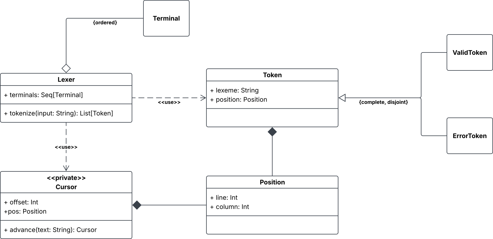

# Design di dettaglio

## Analizzatore Lessicale (Lexer)
L'analizzatore lessicale rappresenta il primo filtro della pipeline architetturale.
Il suo scopo è la conversione della stringa di input in uno stream di token,
mantenendo traccia delle coordinate spaziali per la visualizzazione degli errori.

Le principali scelte di design sono ricadute su:
* **Immutabilità e ADT**: Il tracciamento spaziale è delegato a un modulo Position modellato come ADT immutabile.
    Ogni token generato detiene una referenza a una precisa istanza di Position,
    garantendo l'assenza di side-effect durante le fasi successive di parsing.
* **Gestione funzionale degli errori**: Per soddisfare il requisito di tolleranza ai caratteri non riconosciuti senza interrompere la pipeline,
  il design esclude il lancio di eccezioni in fase lessicale.
  Viene adottato un approccio polimorfico per i token: i caratteri non validi vengono incapsulati in un costrutto specifico `ErrorToken`, 
  permettendo al lexer di isolare il fallimento e proseguire la _tokenizzazione_ del resto del file.
* **Risoluzione delle ambiguità**: La logica di longest-prefix-match e di priorità dei terminali è centralizzata in una pipeline funzionale 
  che agisce da filtro progressivo (matching delle espressioni regolari, ordinamento per lunghezza del match, fallback sull'ordine di dichiarazione).

L'insieme di sincronizzazione adottato è una sovrastima di quello minimo, in quanto riunisce i
terminali iniziali di tutti i simboli rimanenti nella sequenza anziché arrestarsi al primo che non
possa essere vuoto. La scelta è conservativa e volontaria: nel caso peggiore l'analisi riprende
leggermente in anticipo, segnalando un errore in più, mentre la formulazione minima richiederebbe di
distinguere i simboli annullabili senza alcun beneficio sulla qualità delle segnalazioni.

## Definizione della grammatica

La grammatica in forma EBNF è l'unico ingresso che l'utilizzatore deve fornire per descrivere la sintassi del proprio linguaggio, ed è qui il punto in cui la libreria è più esposta:
la sua forma determina quanto il requisito B2 possa considerarsi soddisfatto. La rappresentazione adottata è un _sum type_ ricorsivo, i casi cui casi corrispondono ai costrutti EBNF: 
elemento vuoto, terminale, nonterminale, concatenazione, alternativa, opzionalità e le due forme di ripetizione. Una grammatica è dunque un albero, ed è la struttura su cui opera la visita
ricorsiva descritta nella sezione successiva. 

Le scelte di design rilevanti riguardano la forma che la definizione assume dal punto di vista di chi la scrive.
* **Operatori EBNF come metodi di estensione.** I costrutti del _sum type_ non vengono invocati direttamente: la composizione avviene tramite operatori simbolici che ricalcano la notazione EBNF. 
    La scelta dei simboli non è arbitraria. Poiché in Scala la precedenza di un operatore è determinata dal suo primo carattere, l'alternativa lega meno della concatenazione e ciascuno dei due è
    associativo a sinistra.
* **Vocabolario del DSL ristretto alla definizione.** Gli operatori di definizione sono membri protetti del tipo che l'utilizzatore estende per dichiarare la propria grammatica. Sono dunque disponibili solo all'interno della 
    definizione e non introducono nomi nel resto del codice cliente.
* **Valutazione lazy delle regole grammaticali.** Il corpo di una regola non viene valutato all'atto della definizione, ma conservato e valutato solo quando la grammatica viene percorsa.
    È ciò che rende possibile definire nonterminali che si riferiscono ad altri nonterminali dichiarati successivamente o a sè stessi. 
* **Nomi dei simboli dedotti dalla definizione.** Ogni terminale e nonterminale assume il nome dell'identificatore che lo introduce, catturato in fase di compilazione. Questo per non creare discrepanza tra nome dichiarato e nome esposto.
* **Terminali espressi uniformemente come espressioni regolari.** Un terminale può essere dichiarato indicandone il lessema esatto oppure un'espressione regolare. Il lessema verrà comunque convertito in una espressione regolare che lo riconosce letteralmente.
* **Ordine di dichiarazione dei terminali preservato.** Poiché l'ordine di dichiarazione ne determina la priorità, la definizione di un terminale lo registra in una collezione ordinata mantenuta dalla
  grammatica. Si accetta consapevolmente uno stato mutabile su un tipo altrimenti immutabile: la mutazione è confinata alla fase di definizione e termina con essa.
* **Identità dei simboli.** I simboli sono confrontati per identità dell'istanza creata dalla definizione, non per struttura. Ciò è possibile perché una grammatica è un oggetto i cui membri
  vengono inizializzati una volta sola, e ogni simbolo attraversa immutato la conversione, la tabella di parsing e il parser. La scelta evita di dipendere dall'uguaglianza strutturale fra espressioni regolari, che l'ambiente non fornisce.
 

## Grammatica processata

Volendo rappresentare il risultato della conversione da grammatica EBNF a CFG pura, si introduce il concetto di grammatica processata (`ProcessedGrammar`), un _product type_ composto da un simbolo di partenza, una collezione di terminali e una collezione di produzioni, come espresso dai requisiti.
Anche in questo caso, le priorità dei terminali vengono espresse dal loro ordinamento.

Si introduce il concetto di simbolo nonterminale ad uso interno (`InternalNonterminal`), che può essere utilizzato dagli operatori di ripetizione e dall'algoritmo di left factoring automatico.
Questi nonterminali sono distinti da quelli definiti dalla grammatica di partenza, in quanto:
* Non hanno una regola (EBNF) che li definisca.
* Non hanno un nome definito dall'utilizzatore. In fase di implementazione verrà aggiunto un nome ad uso interno.
* Non appaiono all'interno del CST generato dal parser.

Queste differenze giustificano la creazione di un tipo distinto. Ad ogni modo, si tratta di simboli che possono apparire come teste di produzioni.
Per questo scopo viene introdotto un _sum type_ che includa entrambi i tipi di nonterminali.
Inoltre, all'interno dei corpi di produzione possono apparire simboli di qualsiasi genere. Si definisce dunque un ulteriore tipo che riunisca terminali e nonterminali sia ad uso interno che non.

A questo punto, le produzioni sono rappresentate dall'associazione di un nonterminale come testa a una sequenza ordinata di simboli come corpo.

### Conversione

Data la struttura ad albero della grammatica EBNF in ingresso, il processo di conversione avviene attraverso una visita ricorsiva ispirata al _visitor pattern_, seppure in chiave funzionale.
La visita comincia a partire dal simbolo iniziale fornito ed esplora automaticamente tutti i simboli raggiungibili da esso.
Ogni chiamata restituisce un risultato intermedio e si occupa di combinare i risultati prodotti dagli eventuali nodi figli, oltre alle proprie informazioni.
A seconda che l'elemento attuale sia una foglia, un operatore unario, o un operatore binario, il numero di chiamate ricorsive varia da zero a due, una per ciascun nodo figlio.
Al termine del processo, il risultato della chiamata iniziale contiene le informazioni necessarie per popolare i campi della grammatica processata.

I risultati intermedi contengono un insieme di alternative e un accumulatore di produzioni generate.
Limitatamente a questa fase interna, si fa riferimento alle "alternative" come l'insieme di possibili sequenze di simboli che l'elemento in questione può assumere all'interno del corpo di produzione che lo contiene.
Si osservi che visitare lo stesso elemento più volte non produce mai nuove informazioni.

Il calcolo delle alternative ed eventuali produzioni generate varia a seconda dello specifico tipo di elemento.
Fra le possibili conversioni che producono una grammatica fattorizzata a sinistra equivalente, si adotta la seguente:

* Elemento vuoto:&ensp;$\mathrm{ALT}(\varepsilon)=\lbrace\, \varepsilon \,\rbrace$,&ensp;$\mathrm{PROD}(\varepsilon)=\emptyset$.
* Terminale:&ensp;$\mathrm{ALT}(b)=\lbrace\, b \,\rbrace$,&ensp;$\mathrm{PROD}(b)=\emptyset$.
* Nonterminale $X$ la cui regola ha come corpo $E$:&ensp;$\mathrm{ALT}(X)=\lbrace\, X \,\rbrace$,&ensp;$\mathrm{PROD}(X)=\mathrm{LFACT}(X, \mathrm{ALT}(E))$.
* Concatenazione:&ensp;$\mathrm{ALT}(E_1E_2)=\mathrm{ALT}(E_1)\cdot\mathrm{ALT}(E_2)$,&ensp;$\mathrm{PROD}(E_1E_2)=\emptyset$.
* Alternativa:&ensp;$\mathrm{ALT}(E_1 \lor E_2)=\mathrm{ALT}(E_1)\cup\mathrm{ALT}(E_2)$,&ensp;$\mathrm{PROD}(E_1 \lor E_2)=\emptyset$.
* Opzionalità:&ensp;$\mathrm{ALT}(E \lor \varepsilon)=\mathrm{ALT}(E)\cup\lbrace\, \varepsilon \,\rbrace$,&ensp;$\mathrm{PROD}(E \lor \varepsilon)=\emptyset$.
* Zero o più:&ensp;$\mathrm{ALT}(E^*)=\lbrace\, R \,\rbrace$,&ensp;$\mathrm{PROD}(E^*)=\mathrm{LFACT}\bigl(R, (\mathrm{ALT}(E)\cdot\lbrace\,R\,\rbrace)\cup\lbrace\,\varepsilon\,\rbrace\bigr)$. 
  Il simbolo $R$ è un nonterminale ad uso interno, introdotto per implementare la ripetizione. Ogni occorrenza di un operatore di ripetizione introduce un simbolo distinto.
* Uno o più:&ensp;$\mathrm{ALT}(E^+)=\mathrm{ALT}(E)\cdot\lbrace\, R \,\rbrace$,&ensp;$\mathrm{PROD}(E^+)=\mathrm{PROD}(E^*)$.

Si è fatto uso della notazione $A \cdot B$ per indicare il prodotto fra insiemi di stringhe, ossia $\lbrace\, \alpha\,\beta \;|\; \alpha \in A, \beta \in B \,\rbrace$.

### Left factoring

La funzione $\mathrm{LFACT}(X,A)$ indica le produzioni generate dall'applicazione dell'algoritmo di left factoring,
che vanno a sostituire le produzioni non fattorizzate $\lbrace\,X\rightarrow\alpha \;|\; \alpha \in A\,\rbrace$.
La strategia adottata prevede, per prima cosa, di raggruppare le alternative in base ad eventuali prefissi comuni.
Per ogni prefisso individuato $\beta_i$ e relativi suffissi $B_i$, viene introdotto un nonterminale ad uso interno $F_i$ e vengono generate le produzioni&ensp;$X\rightarrow\beta_i\,F_i$&ensp;e&ensp;$\mathrm{LFACT}(F_i,B_i)$.
La ricorsione si interrompe per le alternative che non hanno prefissi in comune con altre.

## Tabella di parsing

La rappresentazione di tabelle di parsing segue dai vincoli di dominio.
Viene introdotto l'oggetto `Eoi` per indicare l'esaurimento dell'input, così che possa apparire come colonna nella tabella, insieme ai terminali della grammatica.

### Costruzione

La costruzione è definita da regole formali, per questo motivo si opta per un'implementazione in programmazione logica.
Poiché questa scelta impatta drasticamente sulla struttura di una parte significativa del sistema, la si considera una decisione di design.
Altri elementi del dominio potrebbero essere espressi in termini di programmazione logica, ma, nel rispetto del requisito I2, si limita l'applicazione a questo solo sottoproblema.

In vista dell'implementazione in programmazione logica, si considera una riformulazione della definizione dei FIRST set e FOLLOW set:
* $\mathrm{FIRST}(\varepsilon) = \lbrace\, \varepsilon \,\rbrace$.
* $\mathrm{FIRST}(b\,\alpha) = \lbrace\, b \,\rbrace$.
* $\mathrm{FIRST}(X_1X_2\!\cdots\!X_n) \supseteq \mathrm{FIRST}(X_1) \setminus \lbrace\, \varepsilon \,\rbrace$.
* Se&ensp;$\varepsilon\in\mathrm{FIRST}(X_1)$&ensp;allora&ensp;$\mathrm{FIRST}(X_1X_2\!\cdots\!X_n) \supseteq \mathrm{FIRST}(X_2\!\cdots\!X_n)$.
* Per ogni produzione $X \rightarrow \alpha$ nella grammatica,&ensp;$\mathrm{FIRST}(X) \supseteq \mathrm{FIRST}(\alpha)$.
* $\mathrm{FOLLOW}(S) \ni \$$&ensp;dove $S$ è il simbolo iniziale.
* Per ogni produzione $Y \rightarrow \alpha\,X\,\beta$ nella grammatica,&ensp;$\mathrm{FOLLOW}(X) \supseteq \mathrm{FIRST}(\beta) \setminus \lbrace\, \varepsilon \,\rbrace$.
* Per ogni produzione $Y \rightarrow \alpha\,X\,\beta$ nella grammatica, se&ensp;$\varepsilon \in \mathrm{FIRST}(\beta)$&ensp;allora&ensp;$\mathrm{FOLLOW}(X) \supseteq \mathrm{FOLLOW}(Y)$.

Il calcolo eseguito dall'engine logico viene integrato nel sistema tramite un'attività specifica, esponendo un'interfaccia astratta rispetto alla tecnologia e implementazione sottostante (vedi requisito I1).
Durante una singola richiesta, l'engine, creato inizialmente con la sola teoria di base, viene aggiornato in base alla struttura della grammatica da elaborare.
Viene sfruttata la funzionalità di registrazione degli oggetti, così che i risultati vengano riportati direttamente in termini di istanze ricevute in ingresso.
Le soluzioni prodotte dall'engine vengono raccolte per popolare la tabella da restituire.

## Analizzatore sintattico
E' il filtro che converte lo stream di token in un CST, guidato dalla tabella di parsing e dal simbolo iniziale ricevuti in costruzione.
La sua interfaccia riflette la separazione tra la fase di costruzione, che si compie una volta sola nella grammatica, e la fase di analisi, ripetibile su input diversi senza ricalcolare nulla.

### Albero sintattico concreto
Il CST è un _sum type_ con tre casi: 
* un nodo di regola, etichettato da un nonterminale e provvisto di una sequenza ordinata di figli.
* una foglia, etichettata dal token riconosciuto
* un nodo di errore, che conserva l'insieme dei terminali attesi e i token scartati durante il recupero.

Il nodo di errore dichiara che l'albero viene prodotto in ogni caso, anche per input malformato, e che il fallimento è un contenuto dell'albero, non un'alternativa ad esso.
Il risultato dell'analisi è un _ product type_ che accosta l'albero all'elenco degli errori riscontrati. Su input scorretto l'albero conserva tutta la struttura riconosciuta, che è l'informazione di cui un decodificare ha bisogno.
Viene comunque esposta un'interfaccia secondaria che riduce il risultato al primo errore.

Il nodo di regola può essere unicamente da un nonterminale dichiarato dall'utilizzatore. I nonterminali ad uso interno non sono ammessi dal tipo.

### Scelte di design
* **Ricorsione al posto della pila esplicita.** L'algoritmo LL(1) è definito in termini di una pula di simboli da riconoscere. L'implementazione non la introduce: la pila è quella delle chiamate, e il riconoscimento di un simbolo e di una sequenza di simboli sono due funzioni mutuamente ricorsive.
    La motivazione è la costruzione dell'albero, che con la ricorsione avviene naturalmente nella risalita, senza introdurre strutture dati parallele per ricomporre i nodi già chiusi.
* **Un simbolo può produrre più nodi.** Il riconoscimento di un simbolo porta ad una sequenza di nodi, questo per rendere possibile l'appiattimento dei nonterminali ad uso interno. Un simbolo interno restituisce direttamente i propri figli, che vengono così assorbiti dal padre, mentre un nonterminale dichiarato
    restituisce unicamente un nodo che li racchiude.
* **Stato e accumolo degli errori come monade.** L'analisi è espressa come composizione di funzioni che ricevono lo stesso stream residuo e restituiscono un valore, lo stream rimanente e gli errori incontrati. La loro composizione propaga lo stream e concatena gli errori.
    Si tratta della combinazione di uno stato e di un accumulatore, resa disponibile come tipo interno della libreria. L'effetto è che le funzioni di analisi si scrivono in forma dichiarativa, senza passare esplicitamente stream ed alenco errori e senza stato mutabile.
* **Insieme di sincronizzazione come attributo ereditato.** L'insieme dei terminali su cui riprendere dopo un errore dipende dal contesto in cui il simbolo corrente è stato espanso. Viene modellato come parametro contestuale, quindi si propaga implicitamente lungo la ricorsione, e sono esplicite solo
    le posizioni in cui viene esteso, ossia quelle in cui si entra in una sequenza e vi si aggiungono i terminali che possono iniziare i simboli rimanenti. 

### Recupero degli errori
L'analisi non viene interrotta quando nessuna transizione è applicabile. L'errore viene comunque registrato, i token in input scartati finchè non se ne incotra uno appartenente all'insieme di sincronizzazione del simbolo corrente e l'ananlisi riprende da li. 
Se il token raggiunto non consente comunque di espandere il simbolo, questo viene abbandonato e sostituito nell'albero da un nodo di errore. Non viene mai invalidata dunque la porzione di albero già costruita.

L'insieme di sincronizzazione adottato è una sovrastima di quello minimo, in quanto riunisce i terminali iniziali di tutti i simboli rimanenti nella sequenza anzichè fermarsi al primo che possa essere vuoto. La scelta è voluta, poiché nel caso peggiore l'analisi riprende leggermente in anticipo, segnalando un errore in più, mentre la configurazione minima richiederebbe di
distinguere i simboli annullabili senza alcun grosso beneficio sulla qualità delle segnalazioni.

La presenza di input residuo dopo il riconoscimente del simbolo iniziale è segnalata come errore invece che essere ignorata.  

## Decodifica CST-AST
